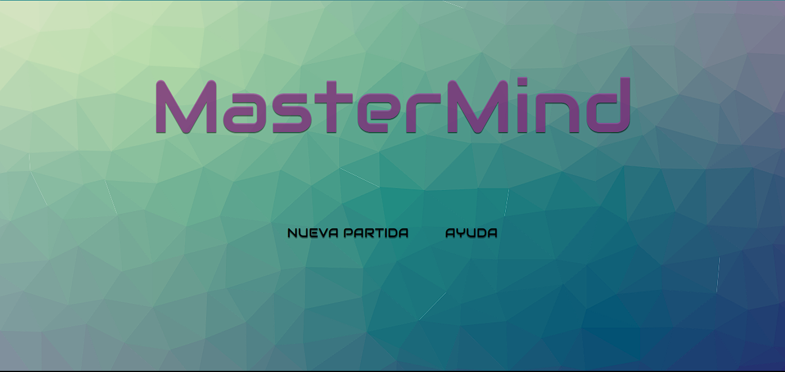

# Mastermind 🕹️🕹️
***
***

   

      
   
      

Este es un proyecto web llamado Mastermind, un juego donde el jugador debe adivinar la combinación correcta de colores. A continuación, se describe cómo se realizó este proyecto y las tecnologías utilizadas.

## Tecnologías Utilizadas
***

- HTML: Utilizado para estructurar la página web y crear elementos interactivos
- CSS:  Aplicado para dar estilo y diseño a todas las pages
- JavaScript ES6: Utilizado para la parte logica y poder controlar las interacciones y las funciones de cada elemento que lo requiera.

## Reglas y Funcionamiento del Juego
***

En Mastermind, el objetivo es adivinar la combinación correcta de colores. Hay tres niveles de dificultad:

### 👾 Niveles de Dificultad 👾
***

1. **Principiante**👾: Se juega con 4 colores posibles y se tienen 5 intentos.
2. **Intermedio**👾👾: Se eligen entre 5 colores y se tienen 5 intentos.
3. **Avanzado**👾👾👾: Se combinan 6 colores y se tienen 5 intentos.

### Desarrollo del Juego
***

- **Creación de Combinaciones**: Usando los colores disponibles, el jugador debe crear diferentes combinaciones hasta que descubra la solución correcta.
- **Comprobación de Suposiciones**: Después de cada intento, el jugador puede comprobar su suposición. El juego mostrará cuántos colores se han colocado correctamente (marcados con bolas moradas) y cuántos colores se han adivinado correctamente pero colocados en el lugar equivocado (marcados con bolas blancas).

¡Buena suerte! Diviértete jugando Mastermind.
# MasterMind---Game
# MasterMind---Game
# MasterMind
# MasterMind
# MasterMind
# MasterMind
